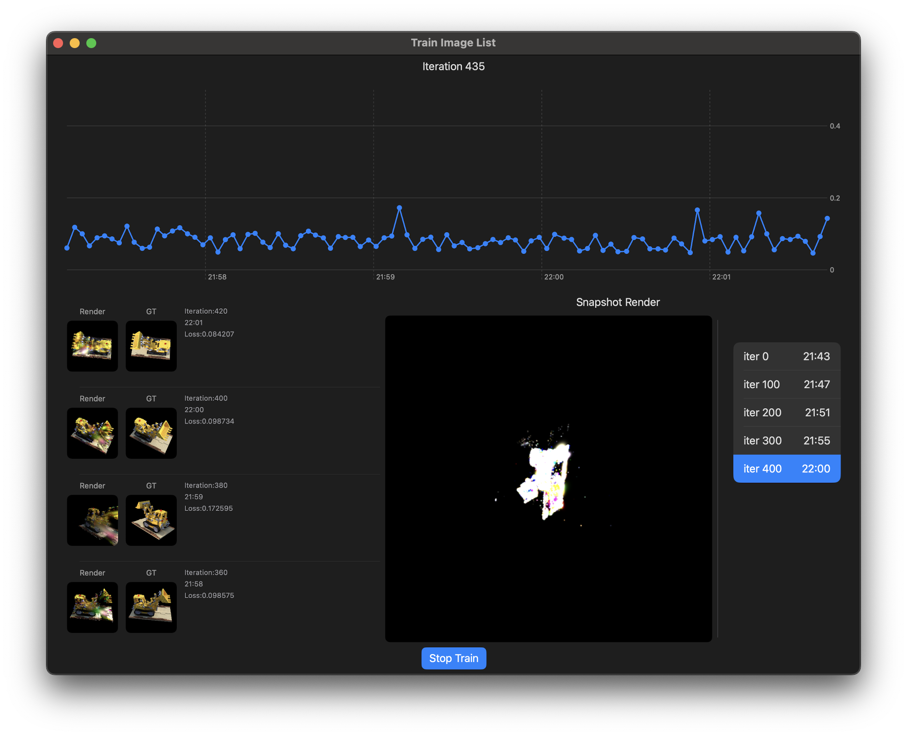

# Gaussian Splatting MLX Implementation

This repository contains a training implementation of 3D Gaussian Splatting using Apple's MLX framework.

## Overview

Gaussian Splatting is a novel approach to Neural Radiance Fields (NeRF) that offers real-time rendering capabilities while maintaining high visual fidelity. This implementation leverages MLX - Apple's efficient machine learning framework designed specifically for Apple Silicon.

## References

This implementation is based on:
* [gaussian-splatting](https://github.com/graphdeco-inria/gaussian-splatting) by INRIA Graphics Lab
* [torch-splatting](https://github.com/hbb1/torch-splatting)

## Implemented Features

* Complete training pipeline for 3D Gaussians
* Chart of train loss
* PLY export for intermediate results visualization
* Support for COLMAP formatted datasets
* Support for NerfStudio formatted datasets

## Upcoming Features

* Gaussian pruning and splitting operations
* Checkpoint visualization
* Memory optimization
* Use ARKit depth as dataset

## Requirements

* Compatible with:
  * iPhone
  * iPad
  * Mac (runs as iPad-compatible app)
* MLX framework

## ScreenShots


## Citation

If you find this implementation useful, please cite the original Gaussian Splatting paper:

```
@article{kerbl3Dgaussians,
  title={3D Gaussian Splatting for Real-Time Radiance Field Rendering},
  author={Kerbl, Bernhard and Kopanas, Georgios and Leimk{\"u}hler, Thomas and Drettakis, George},
  journal={ACM Transactions on Graphics},
  volume={42},
  number={4},
  year={2023},
  publisher={ACM New York, NY, USA}
}
```
